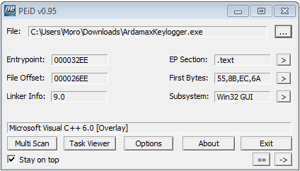
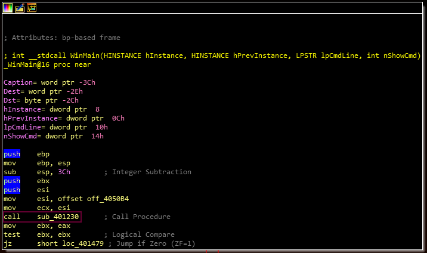
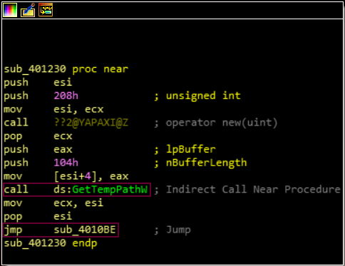
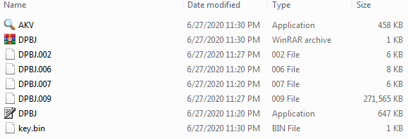
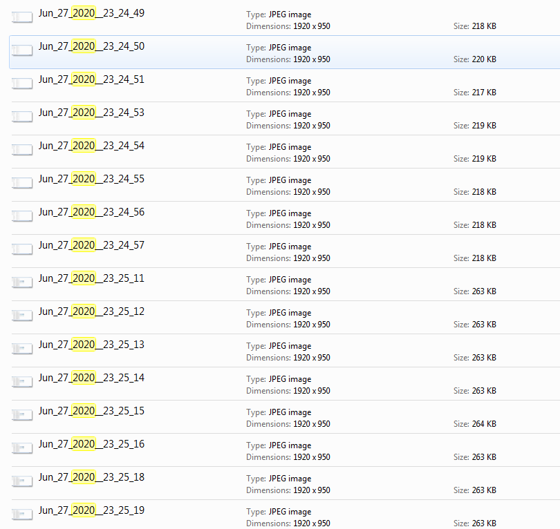

**Ardamax Keylogger**
-------------
[Sample Link](https://github.com/ytisf/theZoo/tree/master/malwares/Binaries/Keylogger.Ardamax)  

Table of Content:  
- Executive Summary and How to remove it.
- Overview.  
1- General Information.  
2- Detection.  
3- Classification.  
- Static Analysis.  
1- Packing.  
2- Exploring DLLs.  
3- Disassembling.
- Dynamic Analysis.  
1- Executing and Processes Monitoring.  
2- Contacted Domains.  
3- Persistance.  
4- Analysis of Dropped Files.  
- YARA Rules.  

---------------

**Executive Summary:**  
- Ardamax was first detected in 2013/05/31 and it's still active till today.  
- After execution Ardamax drops multiple files to a system directory.  
- Ardamax constantly records keyboard strokes and screenshots and it automatically sends them to a server.  
- Ardamax automatically deletes sent files.  
- Follow along with this [detailed article](https://www.free-uninstall.org/how-to-remove-ardamax-keylogger/) to remove it but be careful when deleting registry keys as it might cause irreversible problems. 

------------------
*Overview*

**General Information (Dropper):**  
1- File Type: PE32 executable (GUI) Intel 80386, for MS Windows.  
2- File Size:	784 kB.  
3- Time Stamp: 2009/03/04 08:29:05.  
4- MD5: E33AF9E602CBB7AC3634C2608150DD18.  
5- SHA256: 8C870EEC48BC4EA1ACA1F0C63C8A82AAADAF837F197708A7F0321238DA8B6B75.

**General Information (Keylogger):**  
1- File Type: Win32 EXE.  
2- File Size:	892 kB.  
3- Time Stamp: 2009/03/04 08:29:13.  
4- MD5: 980A3BB582A8C5FF6111C58FF85D2875.  
5- SHA256: A62969CB8632BDBBFCE65BB40A2D42DC70568153AAE602331A7E6F47DE39AF19.  

**Detection:**

**Classification:**

---------------
*Static Analysis*

**Packing:** PEiD didn't detect any packers for the dropper.

**Exploring DLLs and Imports:**  

Interesting Imports:

- AccessCheck  
- AccessCheckAndAuditAlarmW  
- AccessCheckByType  
- AccessCheckByTypeAndAuditAlarmW  
- AccessCheckByTypeResultList  
- AccessCheckByTypeResultListAndAuditAlarmByHandleW  
- AcquireCredentialsHandleA  
- AddAccessAllowedAce  
- AddAccessDeniedAce  
- AddAuditAccessAce  
- AddAuditAccessObjectAce  
- AdjustTokenGroups  
- AdjustTokenPrivileges  
- AllocateAndInitializeSid  
- AllocateLocallyUniqueId  
- AreAllAccessesGranted  
- AreAnyAccessesGranted  
- ChangeServiceConfigW  
- CheckTokenMembership  
- ConnectNamedPipe  
- ControlServiceExW  
- ConvertToAutoInheritPrivateObjectSecurity  
- CreateNamedPipeW  
- CreatePipe  
- CreatePrivateObjectSecurity  
- CreatePrivateObjectSecurityWithMultipleInheritance  
- CreateRestrictedToken  
- CryptCreateHash  
- CryptDestroyHash  
- CryptDestroyKey  
- CryptDuplicateHash  
- CryptDuplicateKey  
- CryptEncrypt  
- CryptEnumProvidersA  
- CryptExportKey  
- CryptGenKey  
- CryptGenRandom  
- CryptGetHashParam  
- CryptGetKeyParam  
- CryptGetProvParam  
- CryptGetUserKey  
- CryptHashData  
- CryptSetProviderA  
- CryptSignHashA  
- CryptVerifySignatureA  
- CsrAllocateCaptureBuffer  
- CsrAllocateMessagePointer  
- CsrClientCallServer  
- CsrFreeCaptureBuffer  
- CsrGetProcessId  
- DestroyPrivateObjectSecurity  
- DhcpRequestParams  
- DuplicateToken  
- EnumerateSecurityPackagesA  
- EqualDomainSid  
- GetAclInformation  
- GetDesktopWindow  
- GetFileSecurityW  
- GetKernelObjectSecurity  
- GetNamedPipeAttribute  
- GetNamedPipeClientComputerNameW  
- GetPrivateObjectSecurity  
- GetSecurityDescriptorControl  
- GetSecurityDescriptorDacl  
- GetSecurityDescriptorGroup  
- GetSecurityDescriptorLength  
- GetSecurityDescriptorOwner  
- GetSecurityDescriptorRMControl  
- GetSecurityDescriptorSacl  
- GetSidIdentifierAuthority  
- GetSidLengthRequired  
- GetSidSubAuthority  
- GetTokenInformation  
- GetUserNameExA  
- GetWindowsAccountDomainSid  
- ImpersonateAnonymousToken  
- ImpersonateLoggedOnUser  
- ImpersonateSelf  
- InitializeAcl  
- InitializeSecurityContextA  
- InitializeSecurityDescriptor  
- InitializeSid  
- IsTokenRestricted  
- IsValidAcl  
- IsValidRelativeSecurityDescriptor  
- IsValidSecurityDescriptor  
- JetAttachDatabaseW  
- JetBeginSessionA  
- JetBeginTransaction  
- JetCreateDatabaseW  
- JetCreateTableColumnIndexW  
- JetGetColumnInfoW  
- JetGetDatabaseFileInfoW  
- JetGetSystemParameterW  
- JetGetTableInfoA  
- MakeAbsoluteSD  
- MakeSelfRelativeSD  
- MakeSignature  
- MapGenericMask  
- NotifyServiceStatusChangeW  
- NtCreateMailslotFile  
- NtRemoveProcessDebug  
- NtRequestWaitReplyPort  
- ObjectPrivilegeAuditAlarmW  
- PeekNamedPipe  
- PrivilegeCheck  
- PrivilegedServiceAuditAlarmW  
- RegCreateKeyExA  
- RegDeleteKeyExA  
- RegDeleteValueA  
- RegEnumValueA  
- RegOpenCurrentUser  
- RegOpenKeyExA  
- RegSetValueExA  
- RevertToSelf  
- RtlCaptureContext  
- RtlCaptureStackBackTrace  
- RtlDeleteCriticalSection  
- RtlDeregisterSecureMemoryCacheCallback  
- RtlDeregisterWait  
- RtlDestroyAtomTable  
- RtlDestroyEnvironment  
- SealMessage  
- SetAclInformation  
- SetFileSecurityW  
- SetKernelObjectSecurity  
- SetNamedPipeHandleState  
- SetPrivateObjectSecurity  
- SetSecurityAccessMask  
- SetSecurityDescriptorControl  
- SetSecurityDescriptorDacl  
- SetSecurityDescriptorGroup  
- SetSecurityDescriptorOwner  
- SetSecurityDescriptorRMControl  
- SetSecurityDescriptorSacl  
- SetTokenInformation  
- SetWindowsHookEx  
- TransactNamedPipe  
- WaitNamedPipeW 

From these imports we can tell the following:  
1- It grants itself an access.  
2- It edits and creates some registry keys.  
3- It does some encryption.  
4- It saves keyboard strokes.  
5- It takes screenshots.  
6- It creates a connection pipe and sends files through it.

**Disassembling:**  
Let's start with the main function.  

  

I jumped to this subroutine to check what it does.

It gets a temp path and creates a directory to where the keylogger files will be dropped.  

-------------
*Dynamic Analysis*

**Executing and Processes Monitoring:**  
After Execution Ardamax does the following:  
1- It drops the following files to `C:\Windows\SysWOW64`.  

2- It starts recording keyboard strokes and taking screenshots of current windows.  
* Screenshots are saved in the same directory.  
* Once they're sent they automatically get deleted.

Examples of taken screenshots:  

**Contacted Domains:** Ardamax constantly sends keyboard strokes and screenshots (one by one) to the following domain.

**Persistance:** Ardamax creates an object in the registry `HKLM\SOFTWARE\Wow6432Node\Microsoft\Windows\CurrentVersion\Run` to remain persistent.

**Analysis of Dropped Files:**  
1- AKV: It's used to view the taken screenshots.  
2- DPBJ: It's the main executable and actual keylogger.  
3- DPBJ.002, DPBJ.006, DPBJ007: Subroutines.  
4- DPBJ.009: Where screenshots are encrypted and saved. 
5- Key.bin: It contains multiple activation keys for the executable.

PEiD detected a packer for DPBJ.

After unpacking I opened it with IDA to ensure its functionality.

 

---------------------
**YARA Rules:** Download them from [here](https://malpedia.caad.fkie.fraunhofer.de/details/win.ardamax).
